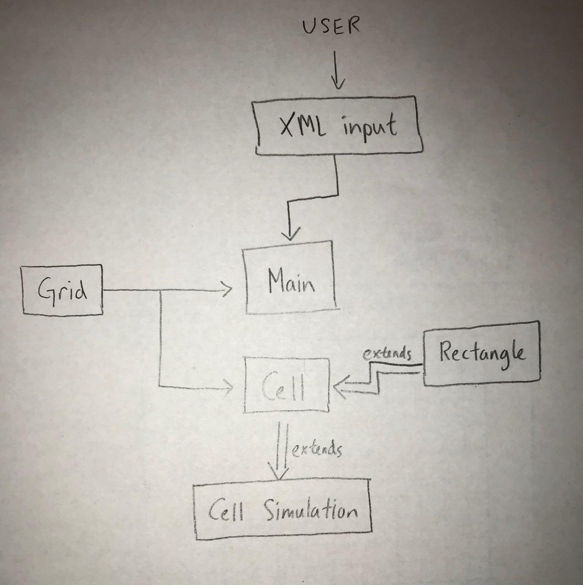
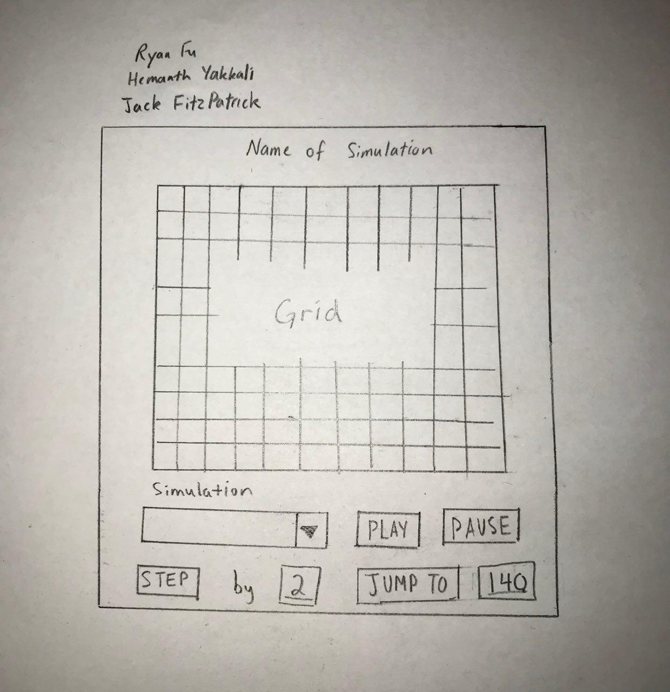

#  Design Plan for Cell Society
## Group 3: Hemanth Yakkali, Jack Fitzpatrick, and Ryan Fu

### Introduction

The aim of this project is to design a program that replicates Cellular Automata (CA). CA is a discrete model that consists of a regular grid of cells. Simulations are based on a cell and its neighborhood of nearby cells. All cells begin in an initial state and are updated based on a set of fixed rules described in terms of the state’s current state and its neighbor’s current states. A variety of simulations can be generated based on a variety of rules.

Our primary design goal of this project is to implement this project using the properties of inheritance. The benefit of this design will allow our group to create classes based on existing classes and acquire their properties. This will not only provide a great deal of utility in our program, but also allow multiple members to work on different features and classes that define our program in a more readable and flexible manner.

In addition, our primary architecture of the design utilizes the Cell and cellSimulation class and will be open for extension because the behavior of these module can be extended and the properties can applied to new applications. In this case, these would be the various rules that define each simulation. The front-end XML input will also be open so that new additions can be made to change the behavior of the front-end interface to meet different inputs from the user. All other modules will be closed for modification because the source code will no longer need to change. This will include the grid class and main class which should have source code that is inviolate because these module perform the same function and have a constant behavior. The grid class outlines the background and grid design of the cells and the main class initiates the program.

### Overview

We plan on creating several different classes that will work together to run the program. We will have a Main class which will extend Application and whose primary role will be to run the program through various built in methods such as start() and step(). We will also have a Grid class which will house two methods, one which  will cause the cells to store the current state of their neighbors (storeCurrentState()) and another which will update the state of each cell (updateState()). The Cell class will extend the Rectangle class since each cell will be a rectangle and will therefore need the methods that come with the JavaFX Rectangle class. The Cell class will have a method to get the states of each of its neighbors as well as update its own state. It will also contain details such as the color of the cell, its value, and an array of its neighbors, all of which will be stored as private variables. We will have a CellSimulation class which would house the simulation parameters, which vary for each type of simulation. Finally, we will have an XML input which will graphically represent the cell grid and be responsible for taking user input from the frontend.

### User Interface

Our goal is to create a user interface that allows the user to select any particular type of simulation and have the program continuously simulate the replication of CA. In addition, we would also like to have a button called “Step” and an integer input. These two inputs together, will allow the user to increment the simulation at a certain integer rate. There will also be a “Play” and “Pause” button which will allow the user to run the simulation for a longer period of time. Lastly, the user can jump to a certain frame using another integer input and a button called “Jump to Frame”. The “Jump to Frame” button cannot jump to past frames, only future frames.  If something other than a number is inputted into any of the fields, including just whitespace, the user will be hit with an error “Not a valid integer input”. Additionally, an integer input of too high a value will also cause an error “Integer value is too high”.

### Design Details

Main.java: This main class will initialize Grid, start the JavaFX application, and tell Grid when to update. It will also initialize the XML reader to read the inputs, and pass that information to the Grid.

XML Reader: This (potential) class will read the input data and pass the information in a friendlier format to Main.

Grid.java: Grid will accept the initial cell locations from Main, and initialize a 2-dimensional array of Cells with that information. It will use certain types of cells based on the information passed from Main. When called by Main, it will tell the Cells when to store their neighbor’s states, and when to update their own state, so every Cell effectively updates simultaneously. Grid will also tell each Cell what its neighbors are when necessary. Grid will handle the edge and corner cases, so Cells may have varying neighbor array sizes.

Cell.java: Cell will be an abstract class that can be extended by simulation-specific Cell types. Cell itself extends the JavaFX class Rectangle, so it can be resized and positioned by Grid. Cell will be able to check and store its neighbors states, and in a different method, update its own state. This method will be overwritten by simulation-specific cells, so they can react differently based on which simulation is being run. Cell will also be able to give its state to its neighbors. Cell will be able to recolor itself based on its state, to make the various states visible to the user.

Simulation-specific Cells: For each new simulation, a new simulation-specific cell class will be created. These Cells simply change the updateState() method to act in different ways, based on their own current states, and the states of their neighbors. These classes will extend Cell, so they are compatible with the Grid class.

### Design Considerations

One aspect of the design that needs to be discussed more at length is the XML input. None of the members of the team are familiar with XML so we all need to do more research and gain some experience using XML in order to come up with a better design for how the XML will interact with the backend. For now, we are able to identify how XML fits into the program from a high-level view but when it comes to the intricacies, the team simply needs more time to learn about XML.

### Team Responsibilities

Ryan - XML front-end development, parsing configurations and connecting the front-end to Main.java

Hemanth - Grid and Main classes, working with Ryan to help backend communicate with frontend and vice versa

Jack - Abstract Cell Class and extending Cell Simulation.

All - Learn more about XML and other design principles and convey such information to the rest of the team

### Use Cases

1. Before the animation starts, Grid will be initialized, which in turn will initialize each Cell. Grid will set each Cell’s neighbor list accordingly during this initialization. Within the step() method of the Main class, there will be a call to the Grid to update cell states. Within Grid, there will be a for loop that calls storeNeighborStates() for each Cell. Then, there will be another loop that calls updateState() for each Cell. In this case, a middle “game of life”-specific Cell will see that based on the number of its neighbors that are alive or dead, it should be dead. When updateState() is called, it will update its state and color.

2. Same as above with the two for loops iterating through each Cell in the Grid. The only potential difference would be that there would be slightly different rules for an edge cell. This difference would be handled in the “game of life”-specific Cell class, based on the length of its neighbor array.

3.  As mentioned in the first use case, all Cells would store their neighbor’s states and then update their own. The results would be seen graphically, because each Cell would recolor themselves based on their state as part of the updateState() method.

4. The simulation-specific Cell for the spreading fire simulation would be used. This cell would have a probCatch variable that would be set from Grid, which gets its information from Main, which read the XML file from the XML Reader.

5. When the simulation was changed in the GUI, Main would update Grid with the new simulation type, and Grid would use the correct simulation-specific Cells to repopulate the board. 

